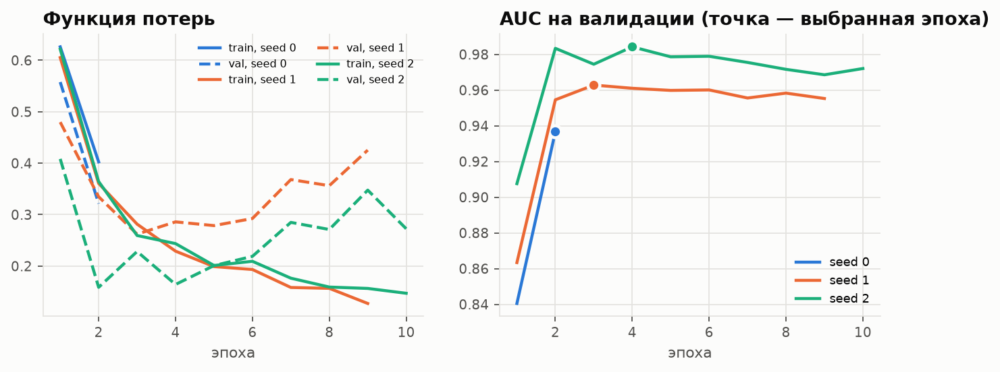
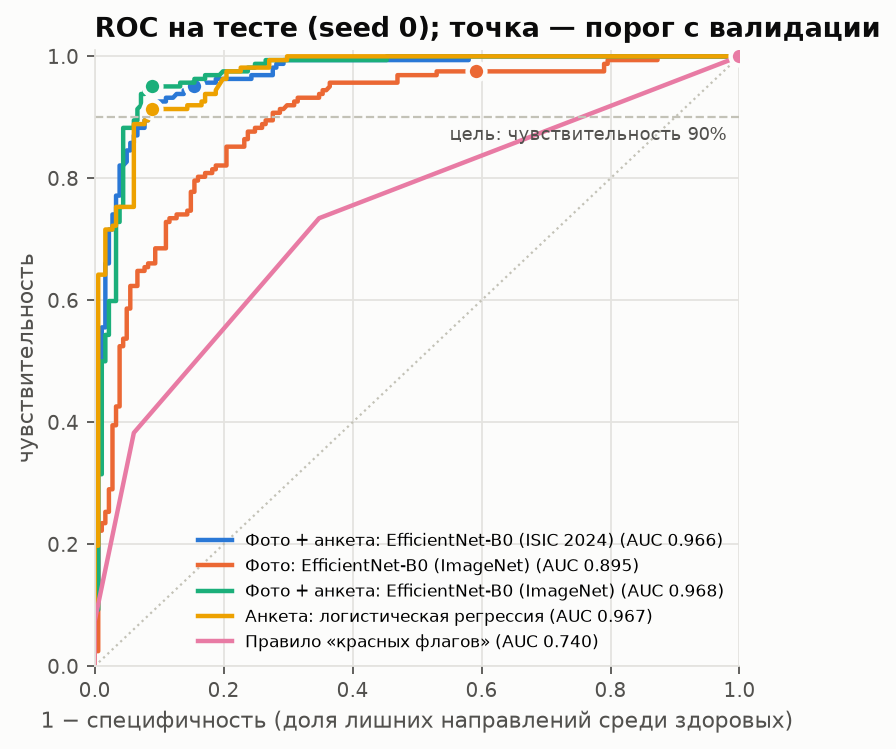
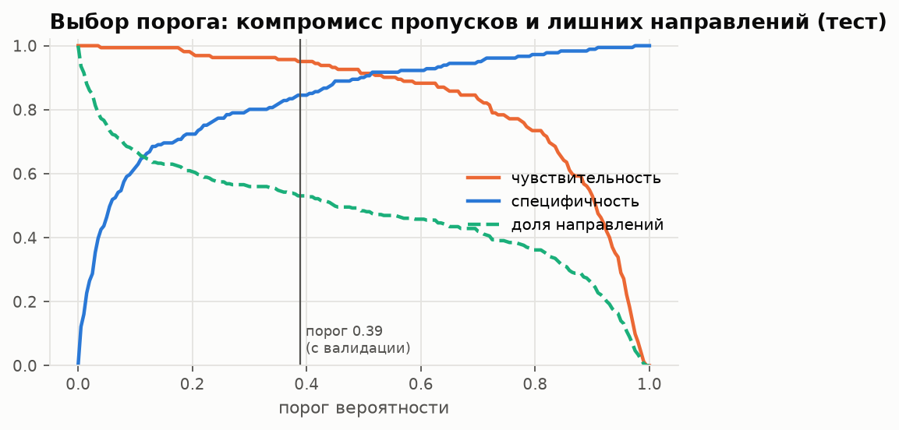
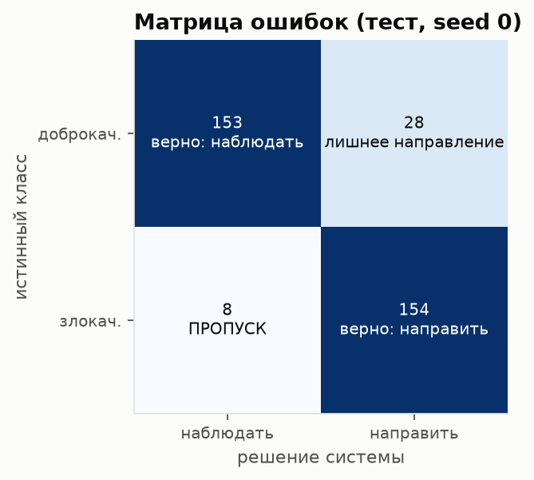
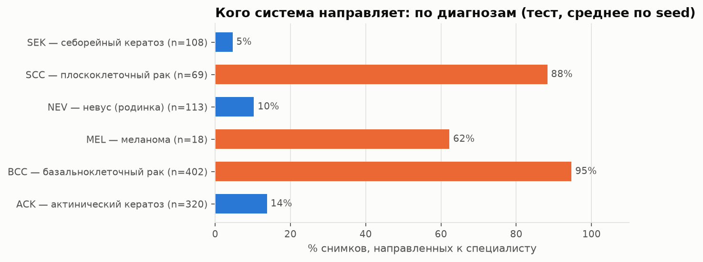
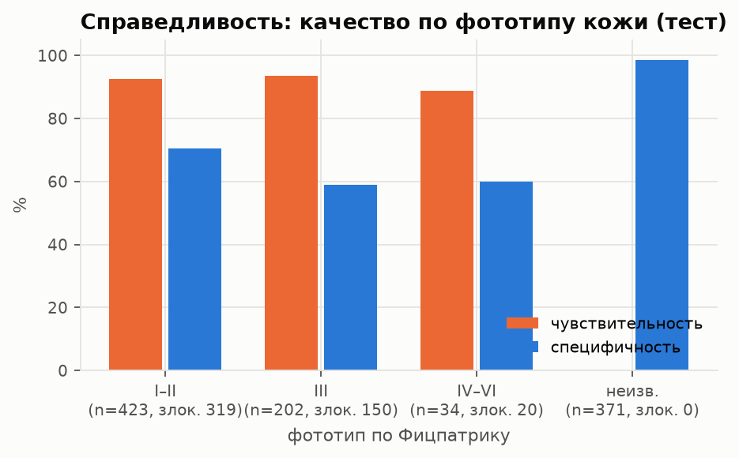
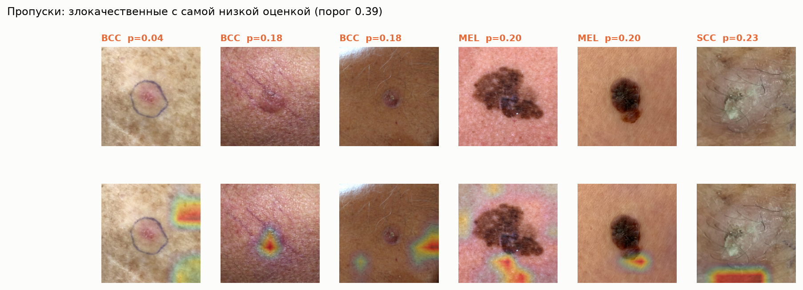
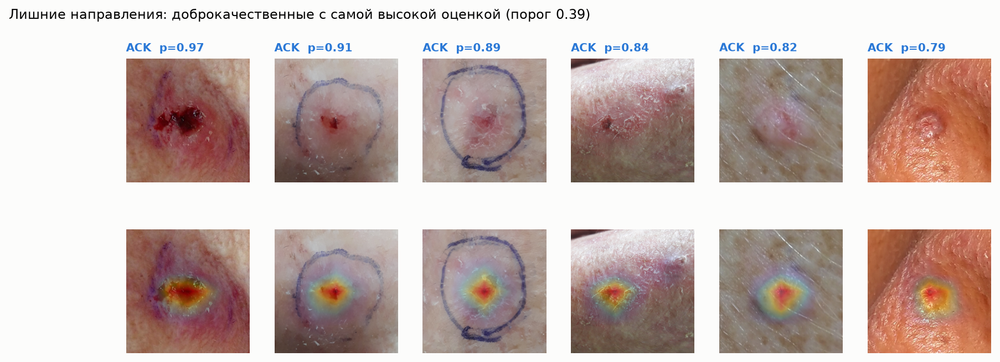
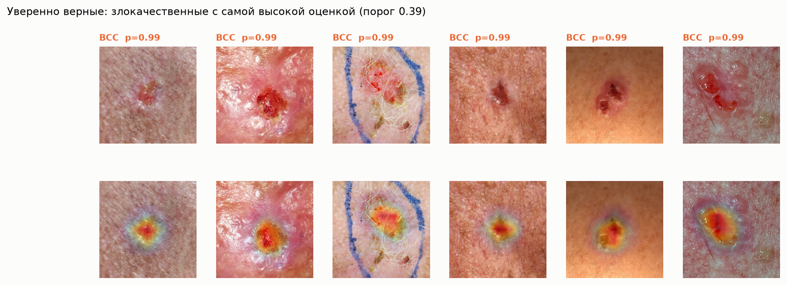

# Анализ: Фото + анкета: EfficientNet-B0 (ISIC 2024)

Запусков (seed): [0, 1, 2]. Сгенерировано `scripts/analyze.py`.

## Кривые обучения

## ROC и выбранный порог

## Матрица ошибок (seed 0, порог 0.388)

Чувствительность 0.951, специфичность 0.845, пропущено злокачественных: 8, лишних направлений: 28.

## По диагнозам: какая доля направлена к специалисту

Для злокачественных (BCC, MEL, SCC) это чувствительность по подтипу; для ACK (предрак) направление клинически оправдано; для NEV и SEK — это лишние направления.

| group   |   n |   malignant |   referral_rate |   sensitivity |   specificity |   auc |
|:--------|----:|------------:|----------------:|--------------:|--------------:|------:|
| ACK     | 320 |           0 |           0.137 |       nan     |         0.863 |   nan |
| BCC     | 402 |         402 |           0.947 |         0.947 |       nan     |   nan |
| MEL     |  18 |          18 |           0.622 |         0.622 |       nan     |   nan |
| NEV     | 113 |           0 |           0.103 |       nan     |         0.897 |   nan |
| SCC     |  69 |          69 |           0.882 |         0.882 |       nan     |   nan |
| SEK     | 108 |           0 |           0.046 |       nan     |         0.954 |   nan |

## Справедливость: по фототипу кожи

Маленькие подгруппы дают неустойчивые оценки — смотрите на n.

| group   |   n |   malignant |   referral_rate |   sensitivity |   specificity |     auc |
|:--------|----:|------------:|----------------:|--------------:|--------------:|--------:|
| I–II    | 423 |         319 |           0.771 |         0.925 |         0.704 |   0.911 |
| III     | 202 |         150 |           0.798 |         0.937 |         0.591 |   0.874 |
| IV–VI   |  34 |          20 |           0.681 |         0.889 |         0.6   |   0.95  |
| неизв.  | 371 |           0 |           0.014 |       nan     |         0.986 | nan     |

## Правило безопасности «красных флагов»

Направить, если модель считает риск высоким ИЛИ в анкете: кровоточит / изменялось / растёт.

| решение                 | чувствительность   | специфичность   | доля_направлений   |   пропусков_всего |
|:------------------------|:-------------------|:----------------|:-------------------|------------------:|
| модель                  | 0.926 ± 0.037      | 0.889 ± 0.041   | 0.498 ± 0.037      |                36 |
| модель ИЛИ красный флаг | 0.969 ± 0.016      | 0.588 ± 0.033   | 0.677 ± 0.023      |                15 |

## Разбор ошибок (Grad-CAM)

