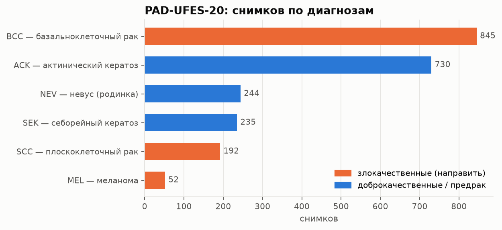
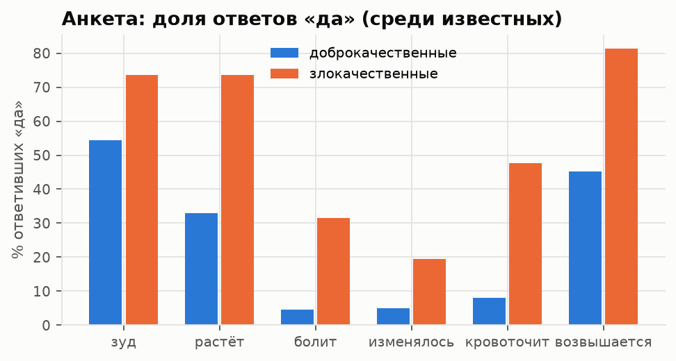
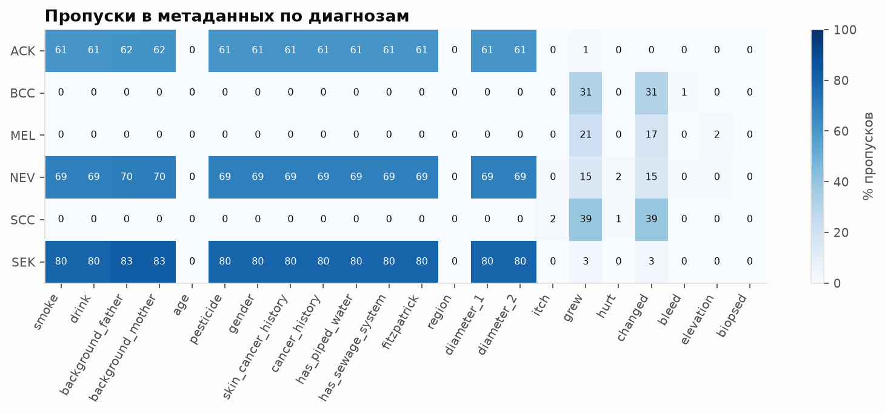
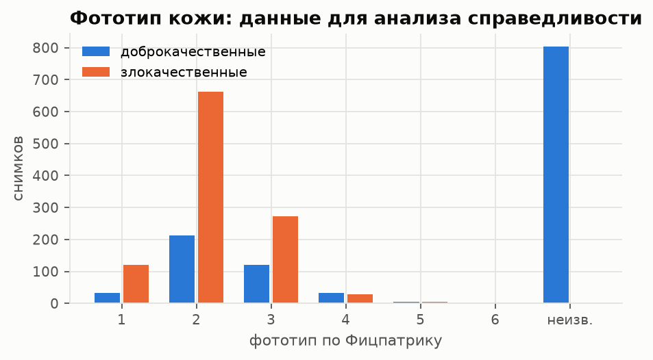
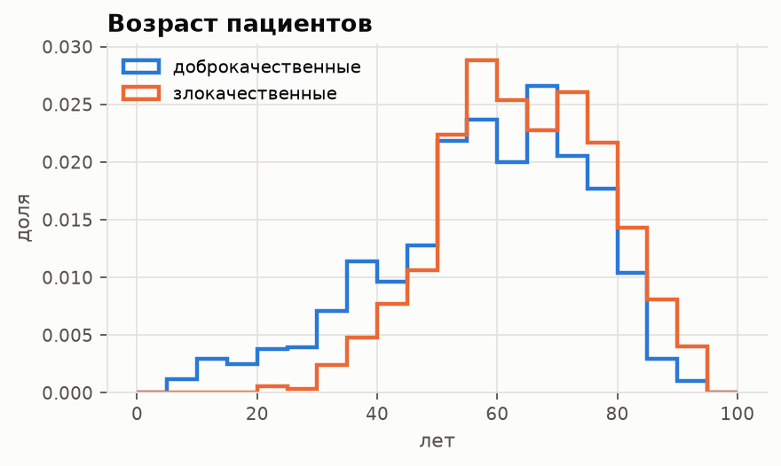
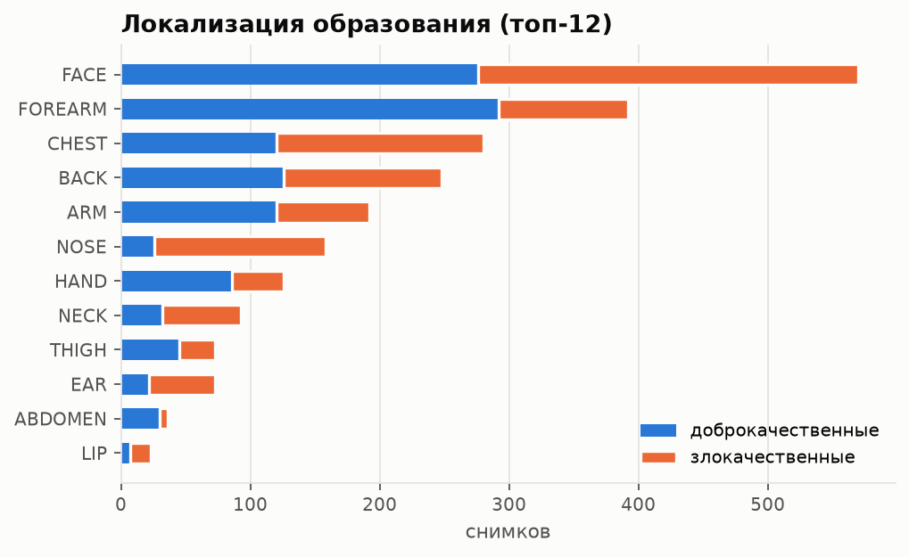
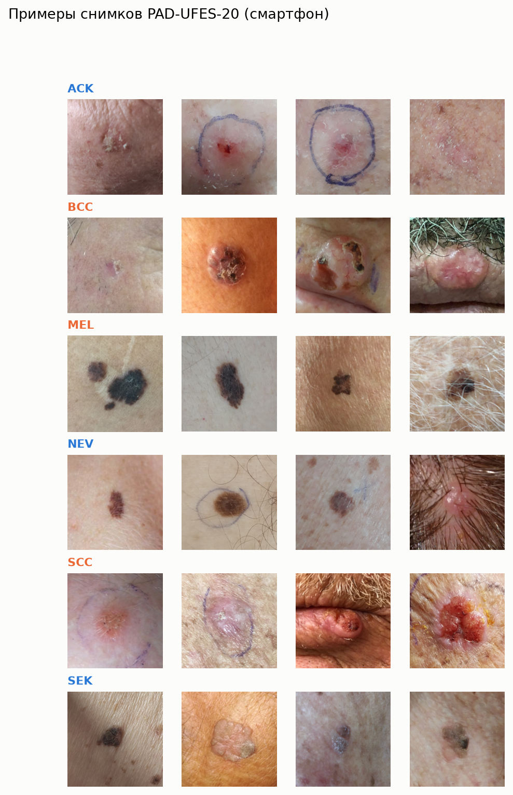
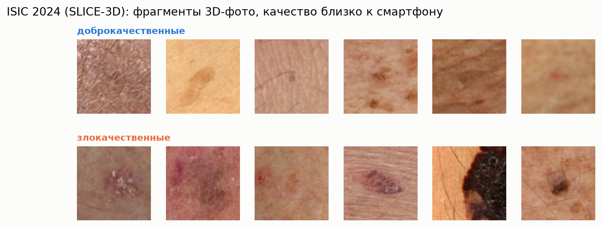

# EDA: сводка

Сгенерировано `scripts/eda.py`. Все числа посчитаны по данным, графики — в этой папке.

## PAD-UFES-20

- Снимков: **2298**, пациентов: **1373**, образований: 1641.
- Доля злокачественных (BCC + MEL + SCC): **47.4%**.
- Пациентов с несколькими снимками: 544 (максимум 10 на пациента) → разбиение по пациентам обязательно.
- Фототип известен для 1494 снимков.
- Размер снимков (проверено 600): медиана короткой стороны 784 px, от 167 до 3120 px.
- **Проверка «коротких путей»:** AUC модели только по факту пропусков в метаданных = **0.866** — ВНИМАНИЕ: способ заполнения анкеты связан с диагнозом; такие поля в модель не включаем.

Диагнозы:

| Диагноз | Снимков |
| --- | --- |
| ACK — актинический кератоз | 730 |
| BCC — базальноклеточный рак | 845 |
| MEL — меланома | 52 |
| NEV — невус (родинка) | 244 |
| SCC — плоскоклеточный рак | 192 |
| SEK — себорейный кератоз | 235 |

Фототип × метка:

| fitzpatrick   |   доброкач. |   злокач. |
|:--------------|------------:|----------:|
| 1             |          33 |       120 |
| 2             |         213 |       663 |
| 3             |         120 |       272 |
| 4             |          33 |        29 |
| 5             |           5 |         5 |
| 6             |           1 |         0 |
| неизв.        |         804 |         0 |

Анкета, доля «да» среди известных ответов и доля «неизвестно»:

| field     |   ('yes_share', 0) |   ('yes_share', 1) |   ('unk_share', 0) |   ('unk_share', 1) |
|:----------|-------------------:|-------------------:|-------------------:|-------------------:|
| bleed     |              0.081 |              0.476 |              0.001 |              0.005 |
| changed   |              0.05  |              0.195 |              0.038 |              0.321 |
| elevation |              0.453 |              0.814 |              0.001 |              0.001 |
| grew      |              0.33  |              0.737 |              0.041 |              0.323 |
| hurt      |              0.045 |              0.316 |              0.005 |              0.004 |
| itch      |              0.543 |              0.737 |              0.002 |              0.003 |

## ISIC 2024 (SLICE-3D)

- Снимков: **401059**, злокачественных: **393** (0.098%) — крайний дисбаланс.
- Пациентов: 1042, из них со злокачественными: 259.

