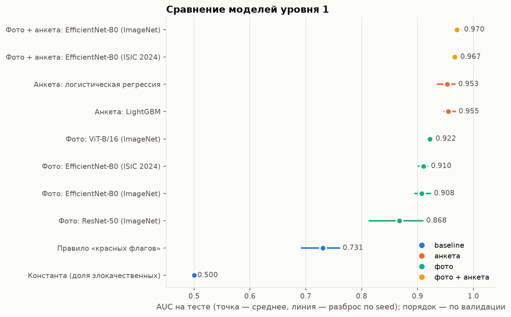

# Результаты экспериментов (тестовая выборка)

Сгенерировано `scripts/collect_results.py` из `runs/*/seed*/metrics.json`. Среднее ± стандартное отклонение по разным разбиениям по пациентам (seed). Чувствительность, специфичность и доля направлений — при пороге, подобранном на валидации под чувствительность ≥ 90%. Строки упорядочены по AUC на ВАЛИДАЦИИ (по ней выбирается финальная модель); тестовые столбцы — независимая оценка.

| Модель                                     | Группа        |   seeds | Val AUC       | AUC           | pAUC80        | Чувствительность   | Специфичность   | Balanced acc.   | Доля направлений   | Параметры, млн   | Задержка, мс   |
|:-------------------------------------------|:--------------|--------:|:--------------|:--------------|:--------------|:-------------------|:----------------|:----------------|:-------------------|:-----------------|:---------------|
| Фото + анкета: EfficientNet-B0 (ImageNet)  | фото + анкета |       3 | 0.968 ± 0.023 | 0.970 ± 0.006 | 0.182 ± 0.004 | 0.910 ± 0.087      | 0.911 ± 0.028   | 0.911 ± 0.032   | 0.479 ± 0.055      | 4.4              | 24.3           |
| Фото + анкета: EfficientNet-B0 (ISIC 2024) | фото + анкета |       3 | 0.963 ± 0.023 | 0.967 ± 0.004 | 0.179 ± 0.004 | 0.926 ± 0.037      | 0.889 ± 0.041   | 0.908 ± 0.011   | 0.498 ± 0.037      | 4.4              | 24.5           |
| Анкета: логистическая регрессия            | анкета        |       3 | 0.957 ± 0.017 | 0.953 ± 0.016 | 0.171 ± 0.007 | 0.867 ± 0.040      | 0.896 ± 0.031   | 0.882 ± 0.031   | 0.466 ± 0.017      | —                | —              |
| Анкета: LightGBM                           | анкета        |       3 | 0.953 ± 0.013 | 0.955 ± 0.011 | 0.173 ± 0.004 | 0.912 ± 0.032      | 0.869 ± 0.036   | 0.890 ± 0.004   | 0.502 ± 0.034      | —                | —              |
| Фото: ViT-B/16 (ImageNet)                  | фото          |       3 | 0.918 ± 0.040 | 0.922 ± 0.004 | 0.149 ± 0.002 | 0.920 ± 0.038      | 0.753 ± 0.103   | 0.836 ± 0.033   | 0.567 ± 0.071      | 85.8             | 14.7           |
| Фото: EfficientNet-B0 (ISIC 2024)          | фото          |       3 | 0.894 ± 0.057 | 0.910 ± 0.008 | 0.141 ± 0.008 | 0.931 ± 0.037      | 0.669 ± 0.106   | 0.800 ± 0.036   | 0.616 ± 0.071      | 4.0              | 22.7           |
| Фото: EfficientNet-B0 (ImageNet)           | фото          |       3 | 0.880 ± 0.070 | 0.908 ± 0.014 | 0.139 ± 0.008 | 0.939 ± 0.037      | 0.633 ± 0.194   | 0.786 ± 0.081   | 0.639 ± 0.116      | 4.0              | 23.3           |
| Фото: ResNet-50 (ImageNet)                 | фото          |       3 | 0.856 ± 0.059 | 0.868 ± 0.049 | 0.122 ± 0.026 | 0.959 ± 0.039      | 0.501 ± 0.151   | 0.730 ± 0.062   | 0.717 ± 0.094      | 23.5             | 16.8           |
| Правило «красных флагов»                   | baseline      |       3 | 0.700 ± 0.031 | 0.731 ± 0.035 | 0.051 ± 0.010 | 1.000 ± 0.000      | 0.000 ± 0.000   | 0.500 ± 0.000   | 1.000 ± 0.000      | —                | —              |
| Константа (доля злокачественных)           | baseline      |       3 | 0.500 ± 0.000 | 0.500 ± 0.000 | 0.020 ± 0.000 | 1.000 ± 0.000      | 0.000 ± 0.000   | 0.500 ± 0.000   | 1.000 ± 0.000      | —                | —              |

## Парные сравнения с «Фото + анкета: EfficientNet-B0 (ISIC 2024)»

| Сравнение                                                                              | ΔAUC (по seed)   | лучше в seed   |
|:---------------------------------------------------------------------------------------|:-----------------|:---------------|
| Фото + анкета: EfficientNet-B0 (ISIC 2024) − Фото: EfficientNet-B0 (ImageNet)          | 0.059 ± 0.012    | 3 из 3         |
| Фото + анкета: EfficientNet-B0 (ISIC 2024) − Фото: EfficientNet-B0 (ISIC 2024)         | 0.056 ± 0.005    | 3 из 3         |
| Фото + анкета: EfficientNet-B0 (ISIC 2024) − Фото + анкета: EfficientNet-B0 (ImageNet) | -0.004 ± 0.003   | 0 из 3         |
| Фото + анкета: EfficientNet-B0 (ISIC 2024) − Фото: ResNet-50 (ImageNet)                | 0.099 ± 0.047    | 3 из 3         |
| Фото + анкета: EfficientNet-B0 (ISIC 2024) − Фото: ViT-B/16 (ImageNet)                 | 0.045 ± 0.007    | 3 из 3         |
| Фото + анкета: EfficientNet-B0 (ISIC 2024) − Константа (доля злокачественных)          | 0.467 ± 0.004    | 3 из 3         |
| Фото + анкета: EfficientNet-B0 (ISIC 2024) − Правило «красных флагов»                  | 0.236 ± 0.038    | 3 из 3         |
| Фото + анкета: EfficientNet-B0 (ISIC 2024) − Анкета: LightGBM                          | 0.012 ± 0.012    | 2 из 3         |
| Фото + анкета: EfficientNet-B0 (ISIC 2024) − Анкета: логистическая регрессия           | 0.013 ± 0.019    | 2 из 3         |

## Предобучение на ISIC 2024 (SLICE-3D)

| Эксперимент | Выборка | Снимков | Злокач. | AUC | pAUC80 (макс. 0,2) | 95% ДИ pAUC80 |
| --- | --- | --- | --- | --- | --- | --- |
| isic_pretrain_efficientnet_b0 | val | 2059 | 59 | 0.891 | 0.123 | [0.070; 0.160] |
| isic_pretrain_efficientnet_b0 | test | 2057 | 57 | 0.921 | 0.142 | [0.113; 0.171] |